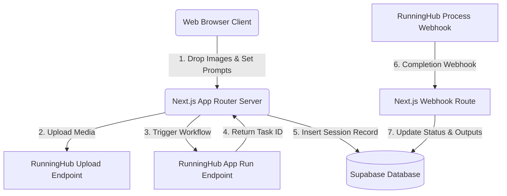

# Boutiqaat Creative Studio

A premium, enterprise-grade AI creative workspace and generation dashboard built for the Boutiqaat team. Powered by RunningHub OpenAPI, this application enables rapid generation of commercial visuals, cinematic campaign assets, and automated product batch processing.

---

## ⚡ Core Creative Apps

1. **Boutiqaat Flow**
   - Transform creative prompts into commercial visuals and cinematic campaign assets instantly.
   - Retains persistent generation history linked to your user account.

2. **Auto Retouch Image** (under Image AI Studio)
   - Professional product photography optimizer with intelligent skin tone restoration, lighting correction, and high-fidelity output.
   - **Split Workflow Layout:** Keeps completed works in the top *Retouch History* panel (featuring interactive 1:1 Before/After sliding previews and batch ZIP downloads) while staging new uploads in the *New Retouch Tasks* inputs panel at the bottom.
   - **Concurrent Batch Processing:** Runs up to 10 images simultaneously by firing multiple API requests concurrently to eliminate queuing bottlenecks.

3. **Batch Background Removal** (under Image AI Studio)
   - Automatically detects and removes product backgrounds for up to 10 images concurrently.

4. **Social Resize** (under Image AI Studio)
   - Automatically adapts aspect ratios of product images to fit social media platforms (1:1, 4:5, 9:16, etc.) with custom positioning.

5. **Video Studio** (under Video Studio)
   - High-fidelity cinematic video generation using text or image prompts.

6. **Batch Video Background Removal** (under Video Studio)
   - Seamlessly removes backgrounds from video files in batches.

7. **Bundling Studio**
   - Creative bundling workspace that automates product catalogs, asset grouping, and prompt-driven layout compositions.

8. **Image Agent**
   - Interactive chat agent that enhances, alters, and builds lifestyle brand assets dynamically.

---

## 🛠️ Tech Stack & Backend Architecture

Understanding how data flows between Next.js, Supabase, and RunningHub:



### 1. Database (Supabase Integration)
* **Tables:**
  - `tasks`: General ledger tracking active run states for the task manager dashboard.
  - `quick_create_sessions`: Dedicated table storing prompts, ratios, and assets generated in Boutiqaat Flow.
  - `retouch_sessions`: Dedicated table isolating Auto Retouch tasks.
* **Fail-Safe Mechanism:**
  If a dedicated table (`quick_create_sessions` or `retouch_sessions`) is not yet initialized in Supabase, the API handlers automatically fall back to querying the general `tasks` table with metadata filters, guaranteeing 100% application uptime.

### 2. RunningHub OpenAPI Interface
* **Proxying API Keys:** All API keys are injected server-side via Next.js Route Handlers (`/api/runninghub/*`). They are never exposed to the client browser.
* **Webhook Endpoint (`/api/webhook/runninghub`):** Receives completion callbacks from RunningHub asynchronously to update Supabase records, removing the need for infinite client polling on finished tasks.

### 3. JWT Authentication & Security
* User sessions are signed using HS256 JWT tokens.
* Stored in `httpOnly` cookies which are inaccessible to client-side scripts, protecting the app from Cross-Site Scripting (XSS) token theft.

---

## 🚀 Local Development Setup

### 1. Install Dependencies
```bash
npm install
```

### 2. Configure Environment Variables
Create a `.env.local` file in the root directory:
```env
NEXT_PUBLIC_APP_NAME="Boutiqaat Creative Studio"
NEXT_PUBLIC_SUPABASE_URL="https://your-project.supabase.co"
SUPABASE_SERVICE_ROLE_KEY="your-supabase-service-role-key"

# RunningHub API Configuration
RUNNINGHUB_BASE_URL="https://www.runninghub.cn"
RUNNINGHUB_API_KEY_ENTERPRISE="your-enterprise-api-key"
RUNNINGHUB_API_KEY_CONSUMER="your-consumer-api-key"

# Authentication Settings
AUTH_USERNAME="editor"
AUTH_PASSWORD="your-secure-shared-password"
AUTH_SECRET="a-very-long-random-string-for-jwt-signing"

# Gemini AI (for image suggestions/analyses)
GEMINI_API_KEY="your-gemini-api-key"
```
> ⚠️ **IMPORTANT:** Never commit `.env.local` to git. It is excluded in `.gitignore` by default.

### 3. Run Developer Server
```bash
npm run dev
```
Open [http://localhost:3000](http://localhost:3000) to view the application locally.

---

## 📦 Deploying to Vercel

The application is configured to deploy automatically on Vercel via GitHub integrations. Every push to the `main` branch triggers a production build.

### Deployment Environment Configuration
Ensure all variables listed in `.env.local` (excluding `NEXT_PUBLIC_` prefixes where public access is not needed) are set in the **Vercel Settings → Environment Variables** dashboard before launching.

* **Live Workspace URL:** [boutiqaat-gen-app.vercel.app](https://boutiqaat-gen-app.vercel.app)
